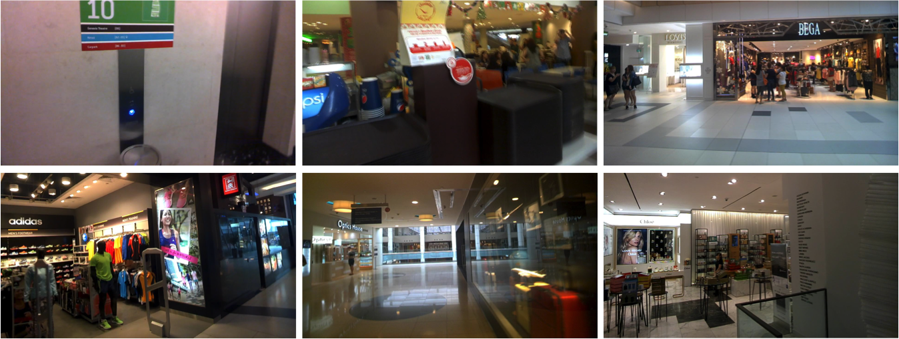

## Overview
|Dataset|Train|Validation|Test|Character-Level Annotation|Word-Level Annotation|
|---|---|---|---|---|---|
|[ICDAR 2013](http://rrc.cvc.uab.es/?ch=2&com=introduction)|229|No|233|Yes (Pixel-Level)|Yes (Rectangle)|
|[ICDAR 2015](http://rrc.cvc.uab.es/?ch=4&com=introduction)|1000|No|500|No|Yes (Quadrangle)|
|[ICDAR 2017 COCO-Text](http://rrc.cvc.uab.es/?ch=5&com=introduction)|43,486|10,000|10,000|No|Yes (Rectangle)|
|[ICDAR 2017 MLT](http://rrc.cvc.uab.es/?ch=8&com=introduction)|7200|1800|email to nibal.nayef@univ-lr.fr|No|Yes (Quadrangle)|

## ICDAR 2013

> Demo images of ICDAR 2013.

The ICDAR 2013 datasets are from the ICDAR 2013 Robust Reading Competition, with 229 natural images for training and 233 for testing. The texts are annotated with character-level bounding boxes, and they are mostly horizontal and well focused.

## ICDAR 2015

> Demo images of ICDAR 2015.

The ICDAR 2015 datasets are from the ICDAR 2015 Robust Reading Competition, with 1000 natural images for training and 500 for testing. The images are acquired using Google Glass and the texts accidentally appear in the scene without user’s prior intention. All the texts are annotated with word-level quadrangles.

## ICDAR 2017 COCO-Text

> Demo images of ICDAR 2017 COCO-Text.

The COCO-Text is a large scale dataset with 43,686 images for training and 20,000 for testing. The original images are from Microsoft COCO dataset.

## ICDAR 2017 MLT
