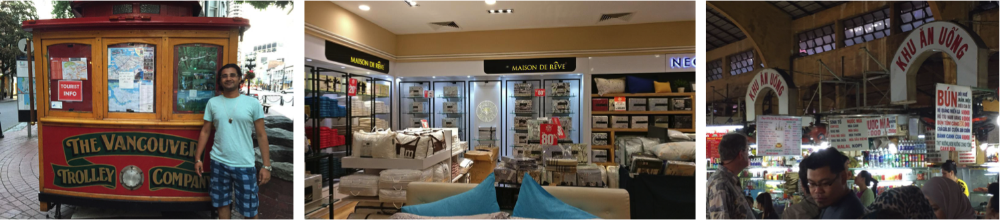

## Overview
|Dataset|Train|Validation|Test|Character-Level Annotation|Word-Level Annotation|Line-Level Annotation|
|---|---|---|---|---|---|---|
|[Total-Text](https://github.com/cs-chan/Total-Text-Dataset)|1255|No|300|Yes|Yes (Polygon)|No|
|[SCUT-CTW1500](https://github.com/Yuliang-Liu/Curve-Text-Detector)|1000|No|500|No|Yes (Polygon)|No|
|[Uber-Text](https://s3-us-west-2.amazonaws.com/uber-common-public/ubertext/index.html)|59,001|23,606|35,362|No|No|Yes (Polygon)|

## Total-Text

> Demo images of Total-Text dataset.

The Total-Text dataset is a more comprehensive dataset than the existing text datasets. The Total-Text consists of 1555 images with more than 3 different text orientations: Horizontal, Multi-Oriented, and Curved, one of a kind.

## SCUT-CTW1500

> Demo images of SCUT-CTW1500 dataset.

The CTW1500 dataset contains 1500 images, with 10,751 bounding boxes (3,530 are curve bounding boxes) and at least one curve text per image. The images are manually harvested from internet, image library like google [Open-Image](https://storage.googleapis.com/openimages/web/index.html) and private data collected by phone cameras, which also contain lots of horizontal and multi-oriented text. The distribution of the images is various, containing indoor, outdoor, born digital, blurred, perspective distortion texts and so on. In addition, the dataset is multi-lingual with mainly Chinese and English text.

## Uber-Text

> Demo images of Uber-Text dataset.

Uber-Text is a large-scale OCR dataset which contains street-level images collected from car mounted sensors and truths annotated by a team of image analysts. The characteristics of the dataset include (1) streetside images with their text region polygons and the corresponding transcriptions, (2) 9 categories indicating the business name text, street name text and street number text, etc, (3) a set containing over 110k images, (4) 4.84 text instances per image on average.
