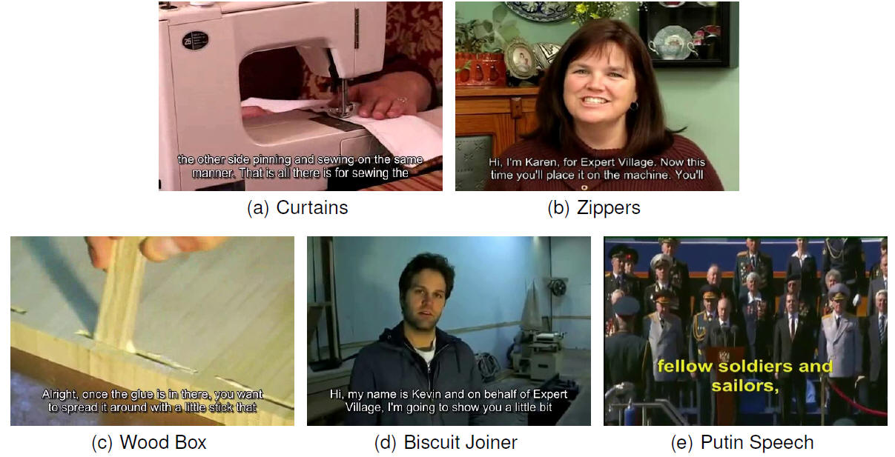

## Overview
|Dataset|Year|Category|Source|Task|Language|
|---|---|---|---|---|---|
|[ICDAR 2017 DOST](http://rrc.cvc.uab.es/?ch=7&com=introduction)|2017|Scene text|Video|Localization/Tracking/Recognition|English/Japanese|
|[USTB-VidTEXT](http://prir.ustb.edu.cn/WebT2DAR)|2016|Embedded caption|Video|Localization/Recognition|English/Chinese|
|[ICDAR 2015 Text in Videos](http://rrc.cvc.uab.es/?ch=3&com=introduction)|2015|Scene text|Video|Localization/Tracking/Recognition|English/Spanish/French/Japanese|
|[YouTube Video](http://vision.ucsd.edu/content/youtube-video-text)|2014|Embedded caption/Scene text|Video|Localization/Tracking/Recognition|English|
|[Merino-Gracia](http://nf.ull.es/research/eav/text/tracking)|2014|Scene text|Video|Tracking|English|
|[ICDAR 2013 Text in Videos](http://dagdata.cvc.uab.es/icdar2013competition/?ch=3)|2013|Scene text|Video|Localization/Tracking/Recognition|English/Spanish/French/Japanese|
|[Minetto](http://www.liv.ic.unicamp.br/~minetto/datasets/text/VIDEOS/)|2011|Scene text|Video|Localization/Tracking/Recognition|English|
|[SVT](http://vision.ucsd.edu/~kai/grocr/)|2010|Scene text|Video frames|Localization/Recognition|English|
|[TREC](https://www-nlpir.nist.gov/projects/t2002v/keyframes/)|2002|Embedded caption/Scene text|Video frames|Search|English|

## USTB-VidTEXT

> Demo images of USTB-VidTEXT dataset.

## References
[1] Xu-Cheng Yin, Ze-Yu Zuo, Shu Tian, and Cheng-Lin Liu, "Text Detection, Tracking and Recognition in Video: A Comprehensive Survey," *IEEE Transactions on Image Processing*, vol. 25, no. 6, pp. 2752-2773, June 2016.
