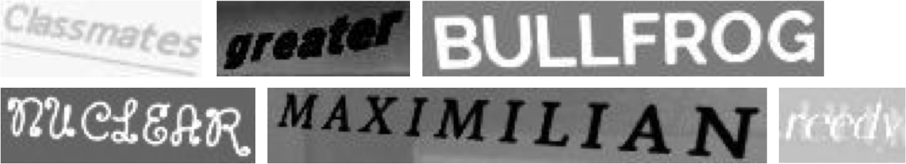
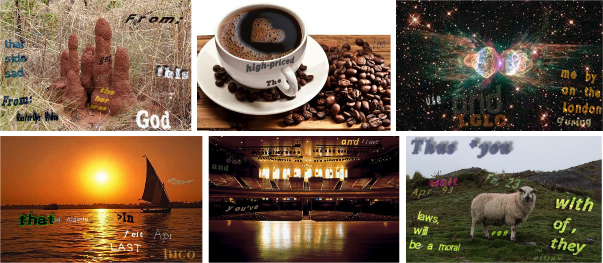

## Overview
|Dataset|Train|Validation|Test|Character-Level Annotation|Word-Level Annotation|
|---|---|---|---|---|---|
|[Synthetic Word](http://www.robots.ox.ac.uk/~vgg/data/text/#sec-synth)|9,000,000|No|No|No|Yes (Cropped Word)|
|[SynthText in the Wild](http://www.robots.ox.ac.uk/~vgg/data/scenetext/)|800,000|No|No|Yes (Rectangle)|Yes (Quadrangle)|

## Synthetic Word

> Demo images of Synthetic word dataset.

This dataset consists of 9 million images covering 90k English words.

## SynthText in the Wild

> Demo images of SynthText in the wild dataset.

This is a synthetically generated dataset, in which word instances are placed in natural scene images, while taking into account the scene layout. The dataset consists of 800 thousand images with approximately 8 million synthetic word instances. Each text instance is annotated with its text-string, word-level and character-level bounding-boxes.
