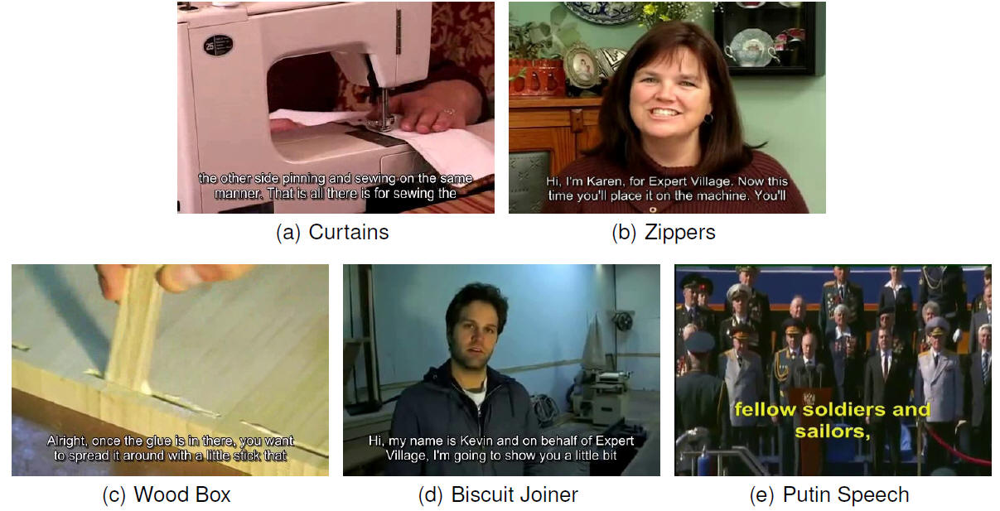

## Overview
|Dataset|Category|Source|Task|Language|
|---|---|---|---|---|
|[ICDAR 2017 DOST](http://rrc.cvc.uab.es/?ch=7&com=introduction)|Scene text|Video|Localization/Tracking/Recognition|English/Japanese|
|[USTB-VidTEXT](http://prir.ustb.edu.cn/WebT2DAR)|Embedded caption|Video|Localization/Recognition|English/Chinese|
|[ICDAR 2015 Text in Videos](http://rrc.cvc.uab.es/?ch=3&com=introduction)|Scene text|Video|Localization/Tracking/Recognition|English/Spanish/French/Japanese|
|[YouTube Video](http://vision.ucsd.edu/content/youtube-video-text)|Embedded caption/Scene text|Video|Localization/Tracking/Recognition|English|
|[Merino-Gracia](http://nf.ull.es/research/eav/text/tracking)|Scene text|Video|Tracking|English|
|[ICDAR 2013 Text in Videos](http://dagdata.cvc.uab.es/icdar2013competition/?ch=3)|Scene text|Video|Localization/Tracking/Recognition|English/Spanish/French/Japanese|
|[Minetto](http://www.liv.ic.unicamp.br/~minetto/datasets/text/VIDEOS/)|Scene text|Video|Localization/Tracking/Recognition|English|
|[SVT](http://vision.ucsd.edu/~kai/grocr/)|Scene text|Video frames|Localization/Recognition|English|
|[TREC](https://www-nlpir.nist.gov/projects/t2002v/keyframes/)|Embedded caption/Scene text|Video frames|Search|English|

## USTB-VidTEXT

> Demo images of USTB-VidTEXT dataset.
